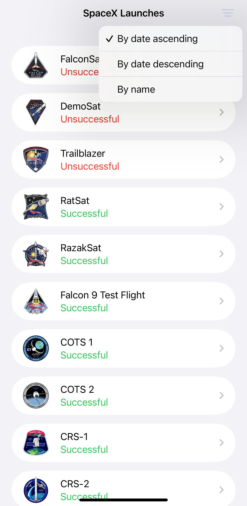
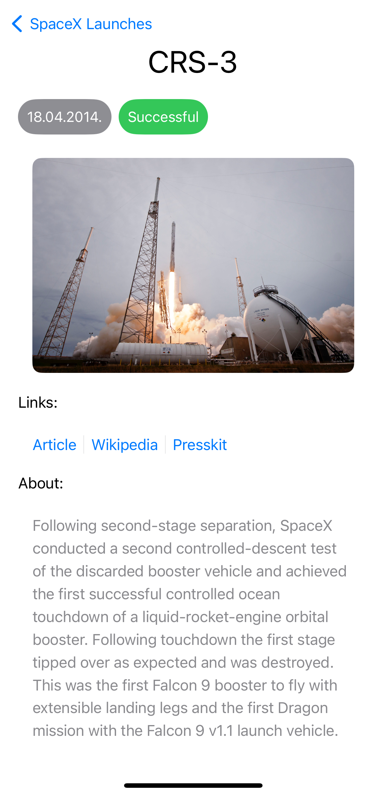
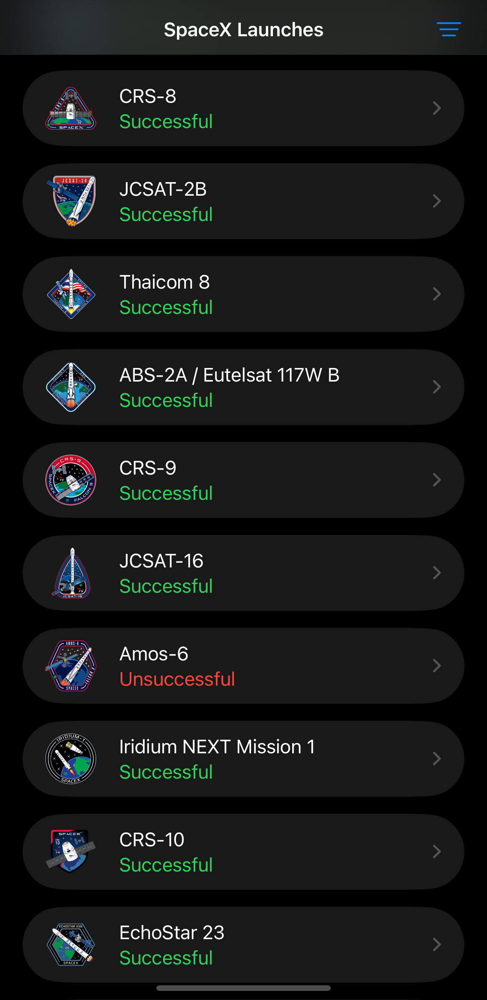
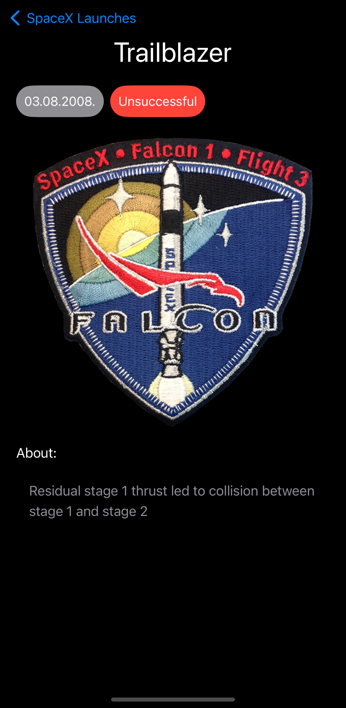

# SpaceX Launches

A native iOS app that lists SpaceX launches and details.

## Features

- List of SpaceX launches loaded from https://github.com/r-spacex/SpaceX-API
  - Option to sort launches by name, date
- Detail screen for each launch
  - Detailed description and information links
- Persisted launch data for offline use
- Dark mode support
- SwiftUI preview snapshot tests
- Model coding and helper unit tests

## Technologies

- SwiftUI for layout
- Combine for data binding
- SwiftData + CachedAsyncImage for data persistence

## Main structure

- Data from API loaded in ApiService and stored as Launch model in SwiftData
- LaunchList and LaunchDetails form the main views for displaying data
- SpaceX_LaunchesTests includes unit tests
- SpaceX_LaunchesSnapshotTests includes view snapshot tests

## Screenshots

